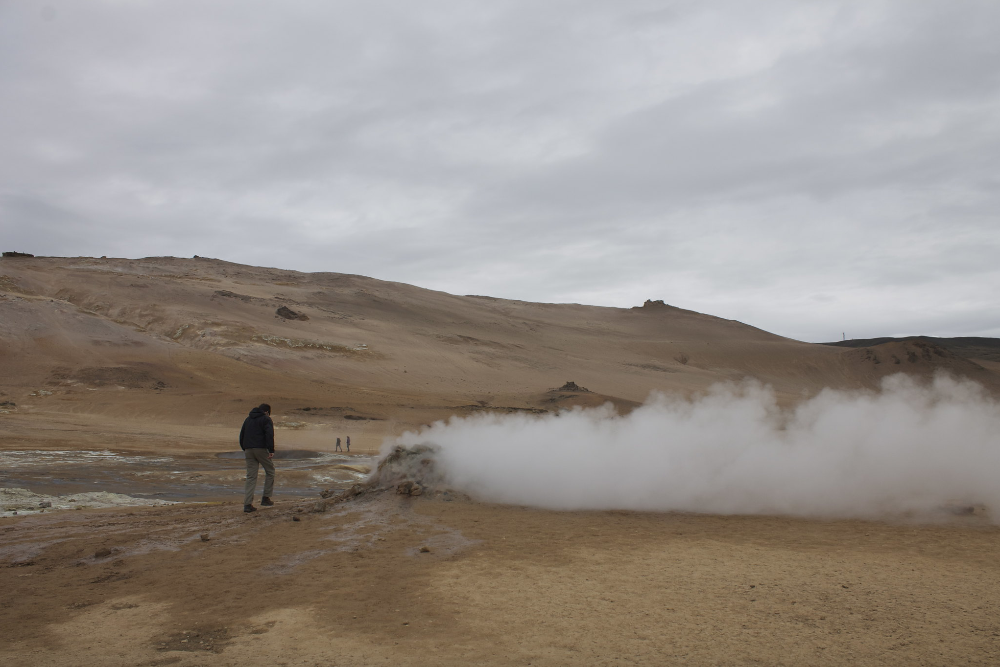

I am currently pursuing my Master's in Environmental Science & Management from the Bren School for the Environment at the University of California - Santa Barbara. Here, I strive to combine data science and journalism to help marginalized groups have the information they need to create a more just world. 

Prior to this, I lived in the Midwest for the past 9-years. I graduated from Macalester College in 2016 with a B.A. in Geology. It was there I conducted <a href="Keck.pdf" target="_blank"><u>research</u></a> on anisotropy of magnetic susceptibility in channelized lava flows in Iceland. At the time I was fortunate enough to work on the Syracuse Lava Project to create analog flows in juxtaposition to the channelized flow at my field site. 

