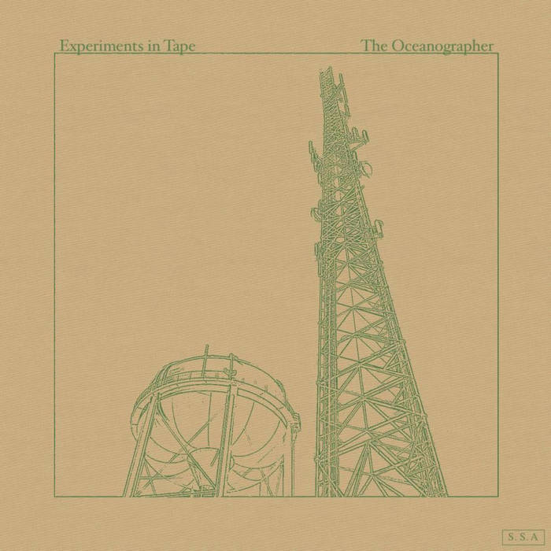
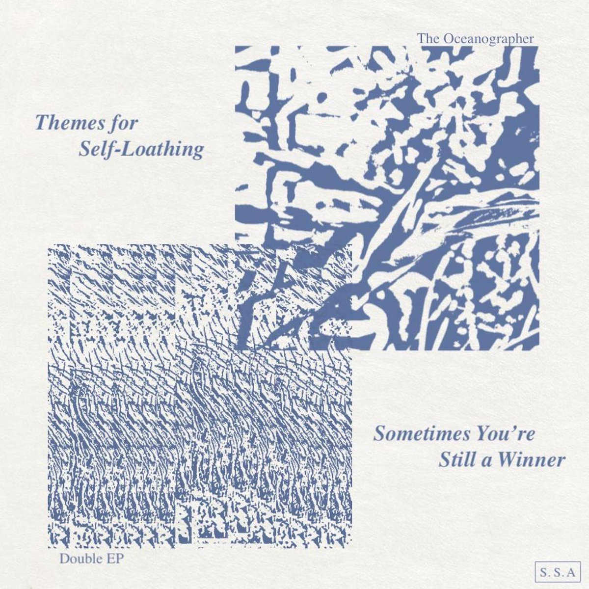

<html>
<head>
<meta name="viewport" content="width=device-width, initial-scale=1">

</head>
<body>

  <a href="https://theoceanographer.bandcamp.com/album/experiments-in-tape">
     
      

        Experiments in Tape
  </a>

  <a href="https://theoceanographer.bandcamp.com/album/themes-for-self-loathing-sometimes-youre-still-a-winner">
     
      

        Themes for Self-Loathing
  </a>

</body>
</html>

